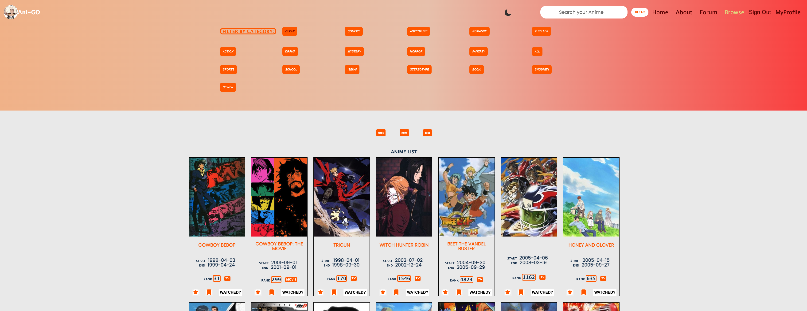

# ANI-GO 

 

Ani-GO is a web info search for anime content.  
What is Anime?  
According to Wikipedia, Anime is a hand-drawn and computer-generated animation originated from Japan.
 
 
 
 
 
 
 

# Functionality
- Users can view and search for whichever anime they are curious about: displayed in the Home page, and the Searchbar, Browsing page and Specific Anime Page.

- Signed-in users can join the Forum page and comment or discuss their favorite anime.

- Signed-in users can also: Bookmark, Favorite, Rate and Checkmark if they watched that anime.

- Lastly, Signed-in users can view their 'Tier Ranking' based on how many anime they've watched in their Profile page.
- A Dark Theme is also included.

# App Sample
Based on an Ultra-Wide Monitor

# Backend

## Endpoints:

| Endpoints                            | HTTP Method | Description                            |
| -----------------------------------  | ----------- | ---------------------------------------|
| `/api/get-user/:userId`              | GET         | Getting the User                       |
| `/api/add-user`                      | POST        | Adding the User to the database        |
| `/api/add-favorite`                  | PATCH       | Add favorite anime to the database     |
| `/api/add-bookmarks`                 | PATCH       | Add bookmarked anime to the database   |
| `/api/add-watch`                     | PATCH       | Add watched anime to the database      |
| `/api/delete-content/:collectionId`  | DELETE      | Update one item quantity in database   |
| `/api/add-rating`                    | PATCH       | Add rating to the database             |
| `/api/comment`                       |PATCH        | Creating and Adding comments to forum  |
